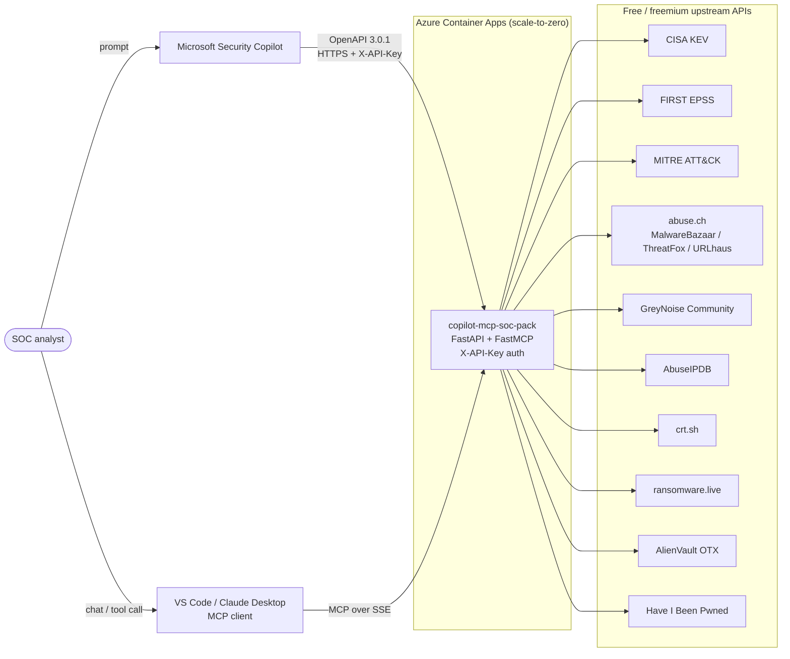

# copilot-mcp-soc-pack

**Community SOC Pack for Microsoft Security Copilot** — free-API MCP server and OpenAPI plugin that gives your SOC instant context from CISA KEV, FIRST EPSS, MITRE ATT&CK, abuse.ch (MalwareBazaar / ThreatFox / URLhaus), GreyNoise, AbuseIPDB, crt.sh, ransomware.live, AlienVault OTX, and Have I Been Pwned.

[](https://portal.azure.com/#create/Microsoft.Template/uri/https%3A%2F%2Fraw.githubusercontent.com%2FNobufumiMurata%2Fcopilot-mcp-soc-pack%2Fmaster%2Fdeploy%2Fazuredeploy.json)

[](https://github.com/NobufumiMurata/copilot-mcp-soc-pack/actions/workflows/build-push.yml)
[](./LICENSE)

> **Status**: **v0.6 Public Preview**. 10 tool groups (24 skills) live across REST + MCP, validated end-to-end against Microsoft Security Copilot. v0.6 hardens the foundation: per-tool unit tests, mypy in CI, Dependabot, httpx retries with exponential backoff, an LRU-bounded TTL cache, and a dedicated `/ready` probe. Looking for SOC feedback before tagging v1.0 — please open an issue or a discussion. Breaking changes possible until v1.0. Security disclosures: see [SECURITY.md](./SECURITY.md). See [ROADMAP](#roadmap) and [Known limitations](#known-limitations).

## Why this exists

Security Copilot ships with great first-party plugins, but SOC teams still spend time copy-pasting IOCs into VirusTotal, checking KEV catalogs, and tracking ransomware group activity. This project bundles the **free, no-account or single-key** sources that every SOC actually uses into **one container**, exposed as both:

- A **Microsoft Security Copilot custom plugin** (OpenAPI 3.0) — invokable from Security Copilot prompts and agents
- A **Model Context Protocol (MCP) server** — usable from VS Code, Claude Desktop, and any MCP-compatible client

One `Deploy to Azure` click → Container Apps (scale-to-zero, < $5/month idle) → register the plugin in Security Copilot → done.

## What's inside (target v1.0)

| Tool | Source | API Key? | Scope | Also available as an official Security Copilot plugin? |
|------|--------|----------|-------|---------------------------------------------------------|
| `kev_lookup` / `kev_search` | [CISA Known Exploited Vulnerabilities](https://www.cisa.gov/known-exploited-vulnerabilities-catalog) | No | Actively exploited CVE catalog | No |
| `epss_score` | [FIRST EPSS API](https://www.first.org/epss/api) | No | Exploit prediction scores | No |
| `attack_technique` / `attack_search` | [MITRE ATT&CK STIX](https://github.com/mitre/cti) | No | TTP lookup with mitigations | No |
| `malwarebazaar_lookup` / `_recent` | [abuse.ch MalwareBazaar](https://bazaar.abuse.ch/) | Required (free key from [auth.abuse.ch](https://auth.abuse.ch/)) | Sample/hash lookup + recent submissions | No |
| `threatfox_recent` / `_search` | [abuse.ch ThreatFox](https://threatfox.abuse.ch/) | Required (same key) | IOC enrichment | No |
| `urlhaus_lookup_url` / `_host` | [abuse.ch URLhaus](https://urlhaus.abuse.ch/) | Required (same key) | Malicious URL feed | No |
| `greynoise_classify` | [GreyNoise Community](https://www.greynoise.io/) | Free key | Scanner noise vs. targeted | **Yes** — [`GreyNoiseCommunity` (Published)](https://github.com/Azure/Security-Copilot/tree/main/Plugins/Published%20Plugins/GreyNoiseCommunity) |
| `abuseipdb_check` | [AbuseIPDB](https://www.abuseipdb.com/) | Free key | IP reputation | **Yes** — `AbuseIPDB (Preview)` built into Security Copilot Sources |
| `crtsh_subdomains` | [crt.sh](https://crt.sh/) | No | Certificate transparency | No |
| `ransomware_live_recent` / `_by_group` / `_by_country` / `_groups` | [ransomware.live](https://www.ransomware.live/) v2 | No | Ransomware victim metadata | No |
| `otx_lookup_ipv4` / `_ipv6` / `_domain` / `_file` / `_url` | [AlienVault OTX](https://otx.alienvault.com/) | Free key | Community threat-intel pulses for any indicator | No |
| `hibp_breaches_by_domain` / `hibp_breach` | [Have I Been Pwned](https://haveibeenpwned.com/) | No | Public data-breach exposure for a domain | No |

> **Why implement GreyNoise and AbuseIPDB anyway?** Microsoft ships official
> plugins for both. Keeping the implementations here gives SOC teams a single
> OSS bundle that works outside Security Copilot (VS Code / Claude Desktop via
> MCP, or plain `curl`) without mixing vendor-managed plugins and
> customer-managed ones. If you only use Security Copilot, feel free to
> disable the `greynoise_classify` and `abuseipdb_check` tools in your
> plugin configuration and use the first-party plugins instead.

**Currently implemented in v0.6**: KEV + EPSS + ATT&CK (v0.1) · Abuse.ch Pack (v0.2) · IP & Domain Reputation (v0.3, GreyNoise / AbuseIPDB / crt.sh) · ransomware.live (v0.4, recent/by_group/by_country/groups) · AlienVault OTX + Have I Been Pwned (v0.5) · reliability hardening + per-tool tests + Dependabot (v0.6).

### Optional environment variables

| Variable | Used by | Notes |
|----------|---------|-------|
| `MCP_SOC_PACK_API_KEY` | All routes | Shared secret for `X-API-Key` header. Leave unset in dev. Compared with `hmac.compare_digest` to mitigate timing attacks. |
| `MCP_SOC_PACK_CORS_ORIGINS` | CORS middleware | Comma-separated list of allowed browser origins (e.g. `https://app.example.com,https://localhost:3000`). **Default: empty** — no browser-origin requests allowed (server-to-server SC / MCP clients are not affected). Set to `*` only for local development. |
| `ABUSE_CH_AUTH_KEY` | `/abusech/*` | Free key from <https://auth.abuse.ch/>. Required — abuse.ch rejects anonymous calls with HTTP 401. |
| `GREYNOISE_API_KEY` | `/greynoise/*` | Free Community key from <https://viz.greynoise.io/signup> → *Account → API Key*. Required for GreyNoise classification. |
| `ABUSEIPDB_API_KEY` | `/abuseipdb/*` | Free key from <https://www.abuseipdb.com/register> → *API → Create Key* (1000 req/day). Required for AbuseIPDB checks. |
| `OTX_API_KEY` | `/otx/*` | Free key from <https://otx.alienvault.com/> → *Settings → API Integration*. Required for AlienVault OTX indicator lookups. |

## Architecture



A single container exposes the same tools two ways: as a Security Copilot custom plugin (REST + OpenAPI) and as an MCP server (SSE) for desktop clients. Upstream API keys are held as Container App secrets and never leave the container.

## Quickstart (local)

```bash
# Requires Python 3.12+
git clone https://github.com/NobufumiMurata/copilot-mcp-soc-pack.git
cd copilot-mcp-soc-pack

python -m venv .venv
# Windows
.venv\Scripts\Activate.ps1
# macOS/Linux
# source .venv/bin/activate

pip install -e .
uvicorn src.app:app --reload --port 8080
```

- OpenAPI docs: <http://localhost:8080/docs>
- MCP SSE endpoint: <http://localhost:8080/mcp/sse>
- Health: <http://localhost:8080/health>

### Try a tool

```bash
curl http://localhost:8080/kev/lookup?cve_id=CVE-2024-3400
```

## Quickstart (Docker)

```bash
docker run --rm -p 8080:8080 ghcr.io/nobufumimurata/copilot-mcp-soc-pack:latest
```

## Azure deployment

Click the **Deploy to Azure** button above. You'll be prompted for:

| Parameter | Description | Default |
|-----------|-------------|---------|
| `containerAppName` | Name for your Container App | `copilot-mcp-soc-pack` |
| `location` | Region | Resource group location |
| `apiKey` | Shared secret that Security Copilot will send in the `X-API-Key` header (leave empty = no auth, do not use in production) | generated |
| `image` | Container image | `ghcr.io/nobufumimurata/copilot-mcp-soc-pack:latest` |

After deployment, copy the Container App FQDN (`https://<name>.<region>.azurecontainerapps.io`) and follow the step-by-step
[Security Copilot registration runbook](./docs/security-copilot-registration.md)
to register the plugin, wire up the `X-API-Key`, and (optionally) upload the
three reference agents defined in [`sc-plugin/agent.yaml`](./sc-plugin/agent.yaml).

### Verify the deployment

`/health` and `/openapi.json` are intentionally **un-authenticated** so they
can back Container Apps liveness probes, uptime monitors, and Security
Copilot's manifest fetch without sharing the API key. Every other route is
gated by the `X-API-Key` header.

A repeatable end-to-end smoke test is shipped at [`scripts/smoke.ps1`](./scripts/smoke.ps1):

```powershell
$env:MCP_API_KEY = az containerapp secret show -g <rg> -n <app> --secret-name api-key --query value -o tsv
./scripts/smoke.ps1 -Fqdn <name>.<region>.azurecontainerapps.io
```

It walks 11 representative endpoints, prints a pass/skip/fail table, and
automatically marks abuse.ch / GreyNoise / AbuseIPDB as `SKIP` when the
upstream key is not configured.

TL;DR:

1. In Security Copilot, go to **Sources -> Custom -> Upload plugin -> Security Copilot plugin** (not "OpenAI plugin" — SC's OpenAI loader does not support shared-secret auth yet).
2. Paste the raw URL of [`sc-plugin/manifest.yaml`](./sc-plugin/manifest.yaml). It declares `Authorization.Type: APIKey` so SC will prompt for the key during setup. (The OpenAI mirror at [`sc-plugin/ai-plugin.json`](./sc-plugin/ai-plugin.json) is kept for completeness only.)
3. When prompted, enter the `X-API-Key` value you set during deployment.
4. Enable the plugin and try a prompt:

   > *What CVEs from CISA KEV were added in the last 30 days that have an EPSS score above 0.5?*

## Using with VS Code / Claude Desktop (MCP)

See [mcp-client-config/](./mcp-client-config/) for ready-to-use configurations.

## Roadmap

- [x] v0.1 Bootstrap — FastAPI + fastmcp scaffold, CISA KEV, EPSS, MITRE ATT&CK, Bicep, Deploy to Azure button
- [x] v0.2 Abuse.ch Pack (MalwareBazaar, ThreatFox, URLhaus)
- [x] v0.3 IP/Domain Reputation (GreyNoise, AbuseIPDB, crt.sh)
- [x] v0.4 ransomware.live tools + Security Copilot integration (native manifest, OpenAPI 3.0.1 downgrade, reference `agent.yaml`)
- [x] v0.5 AlienVault OTX + Have I Been Pwned, smoke harness, `#ExamplePrompts` planner hints, **Public Preview**
- [x] v0.6 Reliability hardening (httpx retries with backoff, LRU-bounded TTL cache, `/ready` probe), per-tool unit tests, mypy in CI, Dependabot, single-source version, PR-based workflow
- [ ] v0.7 Promptbook samples, structured eval harness, security hardening (CORS scoping, constant-time API-key compare), Application Insights tracing
- [ ] v1.0 Hardening (Managed Identity inbound, full upstream retry coverage, custom metrics, Sentinel Workbook), GA based on Preview feedback

## Known limitations

This is a **Public Preview**. The following are intentional gaps today; PRs and issues welcome.

- **Inbound auth is API key only.** No Managed Identity, no Entra ID inbound, no per-caller RBAC. Rotate the shared `MCP_SOC_PACK_API_KEY` regularly.
- **No upstream retry / circuit breaker on every tool.** v0.6 ships the building block (`request_with_retry` in `src/common/http.py`) and uses it inside `/ready`, but the per-tool clients are not yet wired to it. Until then, an upstream 5xx still surfaces directly to Security Copilot.
- **In-memory TTL cache only.** Cache resets on every cold start (which is expected at scale-to-zero). v0.6 added an LRU eviction cap (default 1024 entries) so long-running replicas no longer leak memory; there is still no Redis or shared cache across replicas.
- **Single region.** The `Deploy to Azure` button provisions one Container Apps environment. There is no multi-region active-active sample yet.
- **Observability is logs only.** Container App logs land in a Log Analytics workspace; there are no custom metrics, traces, or a Workbook yet.
- **`/health` and `/openapi.json` are intentionally un-authenticated** to support Container App probes and OpenAPI ingestion. Restrict ingress (Front Door, IP allow-list, private endpoint) if this is unacceptable.
- **OpenAPI is downgraded to 3.0.1 at runtime.** Microsoft Security Copilot rejects 3.1; downstream tools that rely on 3.1 features should consume the FastAPI source instead of `/openapi.json`.
- **No Sentinel Workbook / Foundry agent sample bundled yet.** Planned for v0.7+.
- **Breaking changes possible until v1.0.** Pin the container image to a semver tag (`:0.5.0`), not `:latest`, and watch the release notes.

## Contributing

PRs welcome. Please keep the free-API, no-scraping, no-raw-leak-data policy intact. See [CONTRIBUTING](./CONTRIBUTING.md) for the project policy, tool-module template, coding style, and release process. A PR template ships under [`.github/PULL_REQUEST_TEMPLATE.md`](./.github/PULL_REQUEST_TEMPLATE.md).

## License

MIT — see [LICENSE](./LICENSE).

## Disclaimer

This project is independent and not affiliated with Microsoft, Anthropic, or any listed third-party service. Users are responsible for complying with the Terms of Service of every external API consumed.
